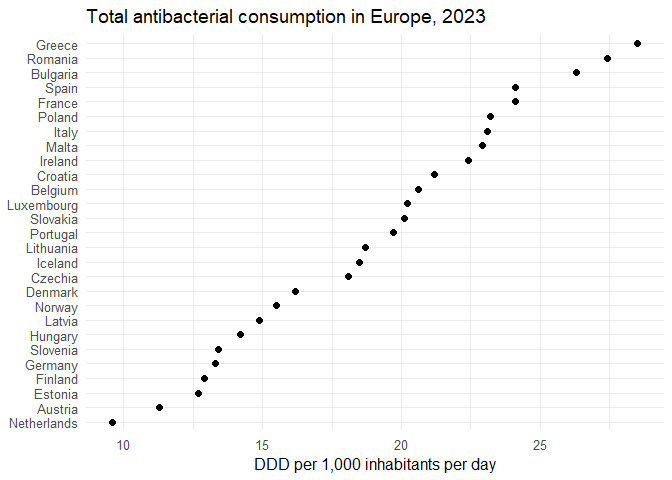
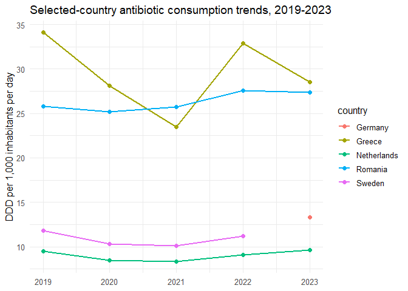
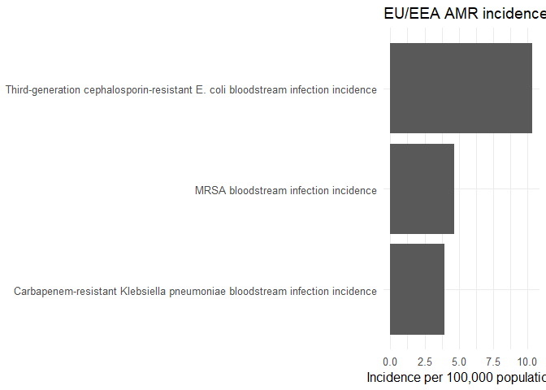

Antibiotic Use and Antimicrobial Resistance: Sweden in European and
Global Context
================

- [Background](#background)
- [Research question](#research-question)
- [Data](#data)
- [Figure 1. EU/EEA antibiotic consumption ranking in
  2023](#figure-1-eueea-antibiotic-consumption-ranking-in-2023)
- [Figure 2. Selected-country trends,
  2019-2023](#figure-2-selected-country-trends-2019-2023)
- [Figure 3. EU-level AMR summary,
  2023](#figure-3-eu-level-amr-summary-2023)
- [Interpretation](#interpretation)
- [Limitation](#limitation)

## Background

Antimicrobial resistance is a global public health problem, but country
patterns differ substantially. This project treats Sweden as a benchmark
low-use, low-AMR setting and compares it with selected European
countries.

## Research question

How does Sweden compare with other European countries in antibiotic
consumption, and how should Sweden be interpreted in a broader global
AMR context?

## Data

``` r
consumption <- read_csv("../data_clean/eu_antibiotic_consumption_total_2019_2023_long.csv", show_col_types = FALSE)
selected <- read_csv("../data_clean/selected_country_antibiotic_consumption_2019_2023.csv", show_col_types = FALSE)
amr_summary <- read_csv("../data_clean/eu_amr_summary_2023.csv", show_col_types = FALSE)
```

## Figure 1. EU/EEA antibiotic consumption ranking in 2023

``` r
consumption %>%
  filter(year == "2023", !is.na(value), !country %in% c("EU", "EU/EEA")) %>%
  mutate(country = fct_reorder(country, value)) %>%
  ggplot(aes(x = value, y = country)) +
  geom_point(size = 2) +
  labs(
    title = "Total antibacterial consumption in Europe, 2023",
    x = "DDD per 1,000 inhabitants per day",
    y = NULL
  ) +
  theme_minimal(base_size = 12)
```

<!-- -->

## Figure 2. Selected-country trends, 2019-2023

``` r
selected %>%
  filter(country != "EU/EEA") %>%
  ggplot(aes(x = as.integer(year), y = value, color = country)) +
  geom_line(linewidth = 1) +
  geom_point(size = 2) +
  labs(
    title = "Selected-country antibiotic consumption trends, 2019-2023",
    x = NULL,
    y = "DDD per 1,000 inhabitants per day"
  ) +
  theme_minimal(base_size = 12)
```

<!-- -->

## Figure 3. EU-level AMR summary, 2023

``` r
amr_summary %>%
  filter(unit == "per 100,000 population") %>%
  mutate(indicator = fct_reorder(indicator, value)) %>%
  ggplot(aes(x = value, y = indicator)) +
  geom_col() +
  labs(
    title = "EU/EEA AMR incidence indicators in 2023",
    x = "Incidence per 100,000 population",
    y = NULL
  ) +
  theme_minimal(base_size = 12)
```

<!-- -->

## Interpretation

Sweden sits on the low end of antibiotic consumption within Europe,
while countries such as Greece and Romania are much higher. The next
step is to append country-level AMR values and add a final global
benchmark figure using WHO GLASS data.

## Limitation

This starter pack contains exact country-year consumption values but
only EU-level AMR summary values. Country-level AMR values should be
added before making strong between-country AMR statements.
